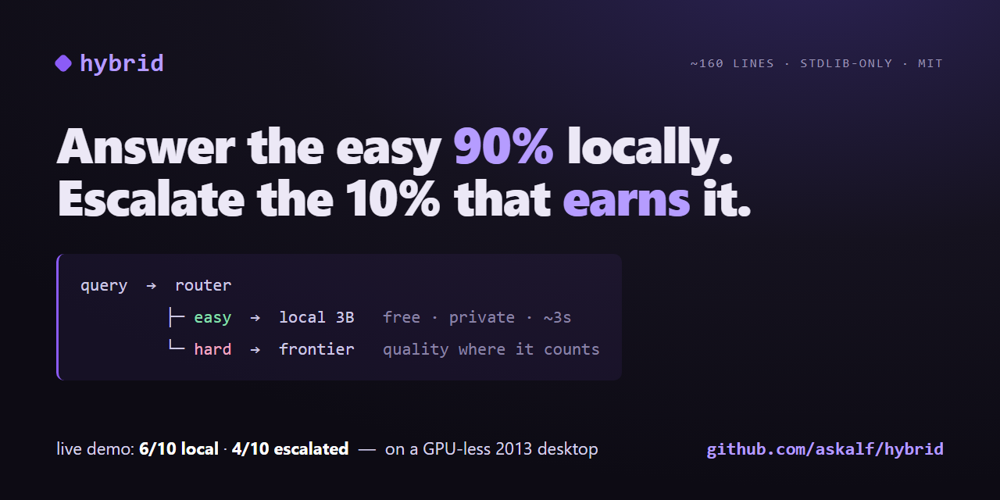

# hybrid — local-first LLM routing with frontier escalation

<p align="center">
  
</p>

Answer the easy majority of your LLM queries on a **small local model** (free,
private, fast); escalate only the genuinely hard ones to a **frontier model**.
Most of what you ask an LLM is easy — facts, rewrites, simple Q&A — and a small
local model nails those. The rare hard query (a proof, real code, multi-step
reasoning) goes to the frontier. Frontier quality where it matters; nothing paid
or sent off your machine for the rest.

~160 lines of dependency-free Python (stdlib only). Built and measured on a
**GPU-less 2013 desktop** — the writeup, with all the numbers, is here:
[**Your CPU isn't bad at LLMs — it's bandwidth-starved**](https://sprayberrylabs.com/blog/own-your-inference).

## How it routes

```
query → router ─┬─ rule: hard category (code/proof/puzzle/powers) ─▶ ESCALATE
                ├─ rule: open-ended (rewrite/summarize)            ─▶ LOCAL
                └─ verify: local self-consistency  ─▶ LOCAL if unanimous, else ESCALATE
```

1. **Category rules** escalate domains a small model is *known* to fail (code,
   proofs, puzzles, powers/roots/factorials) — no point trying locally.
2. **Open-ended rules** keep creative tasks (rewrite, summarize) local — there's
   no single right answer, so the verify step would mis-fire on valid variation.
3. **Verify-then-escalate** for everything else: the local model answers a few
   times; *unanimous* → confident (keep local), otherwise → uncertain (escalate).

## What a run looks like

`python hybrid.py --demo` on a GPU-less 2013 desktop — Qwen2.5-3B local; the
frontier tier here was Claude via a local OpenAI-compatible proxy (point
`FRONTIER_*` at your own). Answers are truncated to one line by `--demo`:

```text
 #  ROUTE     why                         lat  query
--------------------------------------------------------------------------------------------
 1  LOCAL     self-consistent 3/3        7.4s  What is the capital of Japan?
     -> Tokyo
 2  LOCAL     self-consistent 3/3        3.1s  What is 47 times 19?
     -> 893
 3  LOCAL     self-consistent 3/3        9.3s  Define photosynthesis in one sentence.
     -> Photosynthesis is the process by which plants convert light energy into chemical energy stored in glucose.
 4  LOCAL     open-ended (local ok)      2.2s  Rewrite 'hey can u send me that file' mo
     -> "Could you kindly send me the file?"
 5  LOCAL     self-consistent 3/3        6.3s  A bat and a ball cost $1.10 total. The b
     -> The ball costs $0.05.
 6  LOCAL     self-consistent 3/3        6.6s  If a chicken and a half lays an egg and
     -> One chicken would lay 1 egg in one day.
 7  ESCALATE  rule: hard category        6.8s  What is 17 to the power of 4?
     -> 17⁴ = 83,521   (17² = 289, 289² = 83,521)
 8  ESCALATE  rule: hard category        9.8s  Prove that the square root of 2 is irrat
     -> Proof by contradiction. Assume √2 is rational, in lowest terms...
 9  ESCALATE  rule: hard category       24.7s  Write a Python function that returns the
     -> Expand-around-center: treat each char (and gap) as a palindrome center...
10  ESCALATE  rule: hard category       12.3s  I have a 3-liter and a 5-liter jug and u
     -> Fill the 5, pour into the 3, empty the 3, pour the remaining 2 in...
--------------------------------------------------------------------------------------------
LOCAL:     6/10 (60%)  avg 5.8s   free / private
ESCALATED: 4/10 (40%)  avg 13.4s   frontier (Claude, via a local proxy)
```

**Row 6 is the limit, live.** The chicken-and-a-half trap isn't a rule-flagged
category, so it took the verify path — and the 3B agreed with itself **3/3 on the
intuitive wrong answer** ("1 egg"; it's actually ⅔). Confident, consistent, wrong.
Meanwhile "17⁴" *was* rule-flagged, so it escalated and came back right (83,521 —
not the 3B's confident "6859"). What the rules catch versus what slips through the
verifier is the whole finding below.

## Run

```bash
# local tier — Ollama with a small model
ollama pull qwen2.5:3b

# frontier tier — any OpenAI-compatible endpoint
export FRONTIER_API_KEY=sk-...                                    # OpenAI, or your own proxy
export FRONTIER_URL=https://api.openai.com/v1/chat/completions    # default; point anywhere OpenAI-compatible
export FRONTIER_MODEL=gpt-4o                                      # default

python hybrid.py "your question"   # route one query
python hybrid.py --demo            # mixed test set + summary
python server.py                   # OpenAI-compatible server on :8080 (model "hybrid")
```

The server returns an `x_hybrid` field (route / why / backend / latency), so any
OpenAI client (Cursor, Cline, scripts) gets local-first + escalation transparently
and can see which tier answered.

### Config (env)

| var | default | |
|---|---|---|
| `OLLAMA_URL` | `http://127.0.0.1:11434/api/generate` | local Ollama endpoint |
| `LOCAL_MODEL` | `qwen2.5:3b` | local model tag |
| `FRONTIER_URL` | `https://api.openai.com/v1/chat/completions` | any OpenAI-compatible endpoint |
| `FRONTIER_API_KEY` | — | required for escalation |
| `FRONTIER_MODEL` | `gpt-4o` | frontier model id |
| `PORT` | `8080` | server.py listen port |

`FRONTIER_URL` is just an OpenAI-compatible chat endpoint — OpenAI, a local proxy,
or your own gateway. The key only ever leaves your machine on an *escalated* query.

## The honest part (what this taught me)

The interesting finding isn't that it works — it's *where the routing fails*, and
why that's hard:

**A cheap router inherits the cheap model's blind spots — even with verification.**
Self-consistency (answer a few times, escalate on disagreement) catches genuine
*uncertainty*, but it **cannot catch *confident wrongness*.** A 3B model answered
"17⁴ = 6859" *unanimously* (it's 83,521) and walked into a classic rate-trap with
3/3 agreement on the wrong answer — confident, consistent, and wrong. A router
built on the cheap model's *own* signals (classification, self-consistency,
self-assessment) inherits its blind spots; it can't tell confident-and-right from
confident-and-wrong. The only escapes are **category rules** for known-weak domains
(what the rules above do) or a **verifier stronger than the model** (≈ a frontier
call, which defeats the savings for that query). There is no free lunch — which is
exactly why router quality is the open problem in hybrid systems.

This repo keeps that limit *visible* rather than papering over it. `--demo`
includes the trap.

## Files

- `hybrid.py` — router + dispatch + `--demo`
- `server.py` — OpenAI-compatible front end

## License

MIT
